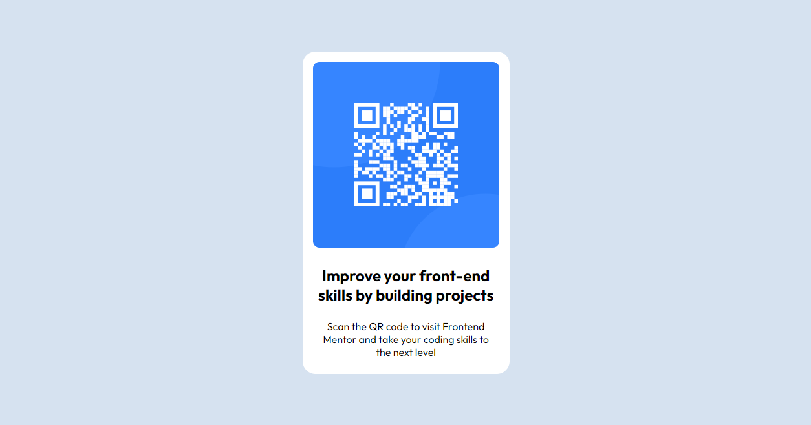

# Frontend Mentor - QR code component solution

This is a solution to the [QR code component challenge on Frontend Mentor](https://www.frontendmentor.io/challenges/qr-code-component-iux_sIO_H). Frontend Mentor challenges help you improve your coding skills by building realistic projects. 

### Screenshot

### Links

- Solution URL: (https://www.frontendmentor.io/solutions/flexbox-7KkLdV7cXG)
- Live Site URL: (https://wiidevyousef.github.io/first_qr_project_flexbox)

### Built with

- Semantic HTML5 markup
- CSS custom properties
- Flexbox

"# first_qr_project_flexbox" 
